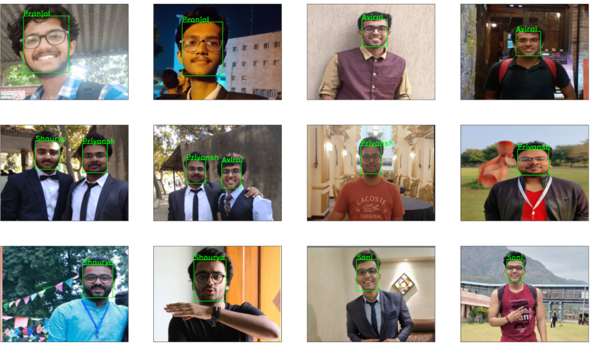

# Facial-Recognition

Face Recognition Model using OpenCV and Deep Learning. 
First Face detection was performed, Used a pre-trained Caffe deep learning model imported using OpenCV to detect faces. This model detects and recognize the faces of five people known to me.
After Detection face embeddings were extracted for each face using deep learning.The FaceNet deep learning model computes a 128-d embedding that quantifies the face. 
Trained a classification on the embeddings, and then finally recognize faces in both images and video streams with OpenCV. 
 

# Facial-Recognition

Face Recognition Model using OpenCV and Deep Learning. 

## Description

First Face detection was performed, Used a pre-trained Caffe deep learning model imported using OpenCV to detect faces. This model detects and recognize the faces of five people known to me. After Detection face embeddings were extracted from each face using deep learning.The FaceNet deep learning model computes a 128-d embedding that quantifies the face. 
Trained a face recognition model on the embeddings, and then finally recognize faces in both images and video streams with OpenCV.

## Getting Started

### Dependencies

* Jupyter Notebook required

* Python Libraries

    - Imutils
    - Tensorflow
    - Keras
    - Numpy
    - Pickle
    - cv2
    - os
    - Scikit-Learn
    - Matplotlib

### Installing

* Download Jupyter Notebook

* No further installation

### Executing program

There are 4 phases of this program, run each of them.

* Extract embeddings from face dataset

* Train face recognition model

* Recognize faces with OpenCV

* Recognize faces in video streams

## Help

Installing the libraries beforehand will solve most issues

## Authors

Contributors names and contact info 
ex. [@priyanshkedia04](https://github.com/priyanshkedia04)

## Version History

* 0.2
    * Documentation added
    * See [commit change]() or See [release history]()
* 0.1
    * Initial Release

## License

GNU General Public License v3.0

## Acknowledgments

Acknowledgements to be added

